# BitChat Connection Establishment Sequence Diagram

This diagram shows the complete process of how devices discover each other via BLE, establish secure connections using the Noise XX handshake pattern, and manage connection state.

```mermaid
sequenceDiagram
    participant A as Alice Device
    participant BLE_A as Alice BLE Service
    participant Noise_A as Alice Noise Service
    participant BLE_B as Bob BLE Service
    participant Noise_B as Bob Noise Service
    participant B as Bob Device

    Note over A, B: Phase 1: BLE Discovery and Connection
    
    A->>BLE_A: startServices()
    activate BLE_A
    BLE_A->>BLE_A: centralManager = CBCentralManager(delegate: self, queue: bleQueue)
    BLE_A->>BLE_A: peripheralManager = CBPeripheralManager(delegate: self, queue: bleQueue)
    
    B->>BLE_B: startServices()
    activate BLE_B
    BLE_B->>BLE_B: Start advertising with serviceUUID
    BLE_B->>BLE_B: peripheralManager.startAdvertising([CBAdvertisementDataServiceUUIDsKey: [BLEService.serviceUUID]])
    
    BLE_A->>BLE_A: startScanning()
    BLE_A->>BLE_A: centralManager.scanForPeripherals(withServices: [BLEService.serviceUUID])
    
    BLE_B-->>BLE_A: BLE Advertisement (serviceUUID)
    BLE_A->>BLE_A: centralManager(_:didDiscover:advertisementData:rssi:)
    BLE_A->>BLE_A: Store ConnectionCandidate(peripheral, rssi, name, isConnectable, discoveredAt)
    
    Note over BLE_A: Connection Scheduling (BLEService.swift:2455-2520)
    BLE_A->>BLE_A: performMaintenance()
    BLE_A->>BLE_A: manageConnections()
    BLE_A->>BLE_A: Check connection budget (maxCentralLinks = 6)
    BLE_A->>BLE_A: Rate limit: lastGlobalConnectAttempt + connectRateLimitInterval
    BLE_A->>BLE_A: Select best candidates by RSSI and recency
    
    BLE_A->>BLE_B: centralManager.connect(peripheral, options: nil)
    BLE_A->>BLE_A: Set peripheral.isConnecting = true
    
    BLE_B-->>BLE_A: Connection established
    BLE_A->>BLE_A: centralManager(_:didConnect:)
    BLE_A->>BLE_A: peripheral.isConnected = true
    BLE_A->>BLE_A: peripheral.discoverServices([BLEService.serviceUUID])
    
    BLE_B-->>BLE_A: Service discovery response
    BLE_A->>BLE_A: peripheral(_:didDiscoverServices:)
    BLE_A->>BLE_A: service.discoverCharacteristics([BLEService.characteristicUUID])
    
    BLE_B-->>BLE_A: Characteristic discovery response
    BLE_A->>BLE_A: peripheral(_:didDiscoverCharacteristicsFor:error:)
    BLE_A->>BLE_A: peripheral.setNotifyValue(true, for: characteristic)
    
    Note over A, B: Phase 2: Noise XX Handshake (3-message pattern)
    
    Note over Noise_A, Noise_B: Message 1: Alice -> Bob (ephemeral key)
    BLE_A->>Noise_A: initiateNoiseHandshake(with: bobPeerID)
    Noise_A->>Noise_A: NoiseSessionManager.initiateHandshake(with: peerID)
    Noise_A->>Noise_A: NoiseSession.startHandshake() [role: .initiator]
    Noise_A->>Noise_A: NoiseHandshakeState(role: .initiator, pattern: .XX, localStaticKey)
    Noise_A->>Noise_A: Generate ephemeral key pair
    Noise_A->>Noise_A: writeMessage() -> ephemeral.publicKey (32 bytes)
    Noise_A-->>BLE_A: handshakeData (Message 1)
    
    BLE_A->>BLE_A: Create BitchatPacket(type: MessageType.noiseHandshake, payload: handshakeData)
    BLE_A->>BLE_B: Write handshake packet via BLE characteristic
    
    BLE_B->>BLE_B: peripheral(_:didReceiveWriteRequests:)
    BLE_B->>BLE_B: handleIncomingPacket(packet)
    BLE_B->>BLE_B: Decode BitchatPacket, type = noiseHandshake
    BLE_B->>Noise_B: processHandshakeMessage(from: alicePeerID, message: payload)
    
    Note over Noise_B: Message 2: Bob -> Alice (ephemeral + encrypted static)
    Noise_B->>Noise_B: NoiseSession(role: .responder, pattern: .XX)
    Noise_B->>Noise_B: processHandshakeMessage(message1)
    Noise_B->>Noise_B: readMessage() -> extract Alice's ephemeral key
    Noise_B->>Noise_B: Generate own ephemeral key pair
    Noise_B->>Noise_B: Perform DH(ephemeral_alice, ephemeral_bob) -> shared secret
    Noise_B->>Noise_B: Encrypt Bob's static key with derived key
    Noise_B->>Noise_B: writeMessage() -> ephemeral_bob + encrypted_static_bob
    Noise_B-->>BLE_B: handshakeResponse (Message 2)
    
    BLE_B->>BLE_A: Send response packet via BLE characteristic
    
    BLE_A->>BLE_A: peripheral(_:didUpdateValueFor:error:)
    BLE_A->>Noise_A: processHandshakeMessage(from: bobPeerID, message: payload)
    
    Note over Noise_A: Message 3: Alice -> Bob (encrypted static)
    Noise_A->>Noise_A: processHandshakeMessage(message2)
    Noise_A->>Noise_A: readMessage() -> extract Bob's ephemeral + decrypt Bob's static
    Noise_A->>Noise_A: Verify Bob's static key authenticity
    Noise_A->>Noise_A: Encrypt Alice's static key
    Noise_A->>Noise_A: writeMessage() -> encrypted_static_alice
    Noise_A-->>BLE_A: handshakeResponse (Message 3)
    
    BLE_A->>BLE_B: Send final handshake message
    
    BLE_B->>Noise_B: processHandshakeMessage(from: alicePeerID, message: payload)
    Noise_B->>Noise_B: readMessage() -> decrypt Alice's static key
    Noise_B->>Noise_B: Verify Alice's static key authenticity
    
    Note over Noise_A, Noise_B: Phase 3: Session Establishment
    
    Noise_B->>Noise_B: handshake.isHandshakeComplete() == true
    Noise_B->>Noise_B: getTransportCiphers() -> (sendCipher, receiveCipher)
    Noise_B->>Noise_B: state = .established
    Noise_B->>Noise_B: Store remoteStaticPublicKey and handshakeHash
    Noise_B->>Noise_B: onPeerAuthenticated callback triggered
    
    Noise_A->>Noise_A: handshake.isHandshakeComplete() == true  
    Noise_A->>Noise_A: getTransportCiphers() -> (sendCipher, receiveCipher)
    Noise_A->>Noise_A: state = .established
    Noise_A->>Noise_A: Store remoteStaticPublicKey and handshakeHash
    Noise_A->>Noise_A: onPeerAuthenticated callback triggered
    
    Note over A, B: Phase 4: Post-Handshake Setup
    
    Noise_A->>BLE_A: onPeerAuthenticated(bobPeerID, fingerprint)
    BLE_A->>BLE_A: sendPendingMessagesAfterHandshake(for: bobPeerID)
    BLE_A->>BLE_A: sendPendingNoisePayloadsAfterHandshake(for: bobPeerID)
    BLE_A->>BLE_A: sendAnnounce(forceSend: true) // Proactive presence nudge
    
    Noise_B->>BLE_B: onPeerAuthenticated(alicePeerID, fingerprint)
    BLE_B->>BLE_B: sendPendingMessagesAfterHandshake(for: alicePeerID)
    BLE_B->>BLE_B: sendPendingNoisePayloadsAfterHandshake(for: alicePeerID)
    BLE_B->>BLE_B: sendAnnounce(forceSend: true)
    
    Note over BLE_A, BLE_B: Connection State Management
    BLE_A->>BLE_A: updatePeerLastSeen(bobPeerID)
    BLE_A->>BLE_A: peers[bobPeerID].isConnected = true
    BLE_A->>BLE_A: requestPeerDataPublish() // Notify UI of connection
    
    BLE_B->>BLE_B: updatePeerLastSeen(alicePeerID)
    BLE_B->>BLE_B: peers[alicePeerID].isConnected = true
    BLE_B->>BLE_B: requestPeerDataPublish()
    
    A<<->>B: Secure Communication Channel Established
    
    deactivate BLE_A
    deactivate BLE_B

    Note over A, B: Key Implementation Details:
    Note over A, B: • BLE discovery uses serviceUUID filtering for privacy
    Note over A, B: • Connection management respects rate limits and connection budgets
    Note over A, B: • Noise XX pattern provides mutual authentication and forward secrecy
    Note over A, B: • Session state is managed thread-safely with dedicated queues
    Note over A, B: • Handshake completion triggers pending message delivery
    Note over A, B: • Connection state updates are published to UI via delegates
```

## Key Components Referenced

### BLE Service (`BLEService.swift`)
- **Connection Management**: Lines 2455-2520 (connection candidate selection and rate limiting)
- **BLE Discovery**: Lines 467-480 (scanning with service UUID filtering)
- **Connection Establishment**: Lines 2210-2250 (peripheral connection and service discovery)
- **Handshake Coordination**: Lines 1680-1720 (initiating and processing Noise handshakes)

### Noise Encryption Service (`NoiseEncryptionService.swift`)
- **Handshake Initiation**: Lines 394-411 (rate limiting and security validation)
- **Message Processing**: Lines 414-440 (handshake message handling with validation)
- **Session Management**: Integration with `NoiseSessionManager` for thread-safe session handling

### Noise Protocol (`NoiseProtocol.swift`)
- **XX Pattern Implementation**: Lines 804-810 (three-message handshake pattern)
- **Key Exchange**: Lines 582-631 (DH operations: ee, es, se, ss)
- **Session Establishment**: Lines 771-781 (transport cipher derivation)

### Transport Configuration (`TransportConfig.swift`)
- **Connection Limits**: Line 24 (`bleMaxCentralLinks = 6`)
- **Rate Limiting**: Line 23 (`bleConnectRateLimitInterval = 0.5`)
- **Timeouts**: Line 145 (`bleConnectTimeoutSeconds = 8.0`)

This sequence shows how BitChat achieves secure peer-to-peer connections through a combination of BLE discovery, connection management, and cryptographic handshake protocols, ensuring both network efficiency and strong security properties.
