# BitChat Message Delivery Sequence Diagram

This diagram shows the complete end-to-end message delivery process, including message creation and signing, broadcast to immediate peers, multi-hop relay through intermediate nodes, final delivery to recipient, and acknowledgment flows.

```mermaid
sequenceDiagram
    participant Alice as Alice (Sender)
    participant AliceBLE as Alice BLE Service
    participant Bob as Bob (Relay Node)
    participant Charlie as Charlie (Relay Node)
    participant Dave as Dave (Recipient)
    participant DaveBLE as Dave BLE Service
    participant UI as Dave's UI

    Note over Alice, UI: Phase 1: Message Creation and Signing

    Alice->>Alice: User types "Hello Dave!" in chat
    Alice->>AliceBLE: sendMessage("Hello Dave!", mentions: [], to: daveID)
    
    Note over AliceBLE: BLEService.swift:756-800 - Message Creation
    AliceBLE->>AliceBLE: messageID = UUID().uuidString
    AliceBLE->>AliceBLE: timestamp = UInt64(Date().timeIntervalSince1970 * 1000)
    AliceBLE->>AliceBLE: Create BitchatMessage(content, senderID, mentions, messageID, timestamp)
    AliceBLE->>AliceBLE: messagePayload = BitchatMessage.toBinaryPayload()
    
    Note over AliceBLE: Private message encryption path
    AliceBLE->>AliceBLE: Check if noiseService.hasSession(with: daveID)
    
    alt Noise Session Exists
        AliceBLE->>AliceBLE: encryptedPayload = noiseService.encrypt(messagePayload, for: daveID)
        AliceBLE->>AliceBLE: Create BitchatPacket(type: MessageType.noiseEncrypted, recipientID: daveID)
    else No Session - Queue Message
        AliceBLE->>AliceBLE: pendingMessagesAfterHandshake[daveID].append((content, messageID))
        AliceBLE->>AliceBLE: initiateNoiseHandshake(with: daveID)
        Note over AliceBLE: Message queued until handshake completes
    end
    
    Note over AliceBLE: Packet signing and TTL assignment
    AliceBLE->>AliceBLE: packet.ttl = messageTTLDefault (7)
    AliceBLE->>AliceBLE: signingData = packet.toBinaryDataForSigning()
    AliceBLE->>AliceBLE: signature = Ed25519.sign(signingData, with: signingKey)
    AliceBLE->>AliceBLE: packet.signature = signature

    Note over Alice, UI: Phase 2: Initial Broadcast to Direct Peers

    Note over AliceBLE: BLEService.swift:1070-1130 - Fanout Selection
    AliceBLE->>AliceBLE: connectedPeripherals = getConnectedPeripherals()
    AliceBLE->>AliceBLE: subscribedCentrals = getSubscribedCentrals()
    AliceBLE->>AliceBLE: totalDegree = peripherals.count + centrals.count
    AliceBLE->>AliceBLE: fanoutK = subsetSizeForFanout(totalDegree) // ~ceil(log2(n)) + 1
    AliceBLE->>AliceBLE: selectedPeers = selectDeterministicSubset(allPeerIDs, fanoutK, messageID)
    
    AliceBLE->>Bob: Write encrypted packet via BLE characteristic [TTL=7]
    AliceBLE->>Charlie: Write encrypted packet via BLE characteristic [TTL=7]
    
    Note over AliceBLE: Message state tracking
    AliceBLE->>AliceBLE: messageDeduplicator.markProcessed(messageID)
    AliceBLE->>AliceBLE: Store message in retry service for delivery confirmation

    Note over Alice, UI: Phase 3: Multi-Hop Relay Through Network

    Note over Bob: First relay hop - Bob receives and processes
    Bob->>Bob: peripheral(_:didReceiveWriteRequests:) [from Alice]
    Bob->>Bob: Decode BitchatPacket from BLE data
    Bob->>Bob: messageID = makeMessageID(packet)
    Bob->>Bob: messageDeduplicator.isDuplicate(messageID) -> false
    Bob->>Bob: ingressByMessageID[messageID] = (link: .central(aliceUUID), timestamp)
    
    Note over Bob: RelayController decision for encrypted directed message
    Bob->>Bob: RelayController.decide(ttl: 7, isDirectedEncrypted: true)
    Bob->>Bob: Always relay directed encrypted messages (shouldRelay: true)
    Bob->>Bob: newTTL = 7 - 1 = 6 (no TTL capping for directed messages)
    Bob->>Bob: delayMs = random(20...60) = 35ms (tight jitter for directed)
    
    Bob->>Bob: Schedule relay: DispatchQueue.main.asyncAfter(deadline: .now() + 0.035)
    
    Note over Bob: Execute relay after jitter delay
    Bob->>Bob: packet.ttl = 6
    Bob->>Bob: availableTargets = connectedPeers - ingressLink (exclude Alice)
    Bob->>Charlie: Relay packet via BLE [TTL=6]
    Bob->>Bob: If no route to Dave, store in pendingDirectedRelays[daveID][messageID]

    Note over Charlie: Second relay hop - Charlie processes
    Charlie->>Charlie: handleIncomingPacket(packet) [from Bob, TTL=6]
    Charlie->>Charlie: messageDeduplicator.isDuplicate(messageID) -> false
    Charlie->>Charlie: RelayController.decide() -> shouldRelay: true, newTTL: 5
    Charlie->>Charlie: Schedule relay with jitter delay
    
    Note over Charlie: Charlie has direct connection to Dave
    Charlie->>DaveBLE: Forward packet to Dave [TTL=5]

    Note over Alice, UI: Phase 4: Final Delivery to Recipient

    Note over DaveBLE: BLEService.swift:1722-1780 - Encrypted Message Processing
    DaveBLE->>DaveBLE: handleIncomingPacket(packet) [from Charlie]
    DaveBLE->>DaveBLE: packet.type == MessageType.noiseEncrypted
    DaveBLE->>DaveBLE: recipientID = packet.recipientID.hexEncodedString()
    DaveBLE->>DaveBLE: Verify recipientID == myPeerID (Dave's ID)
    DaveBLE->>DaveBLE: updatePeerLastSeen(aliceID) // Update from original sender
    
    DaveBLE->>DaveBLE: noiseService.decrypt(packet.payload, from: aliceID)
    DaveBLE->>DaveBLE: decryptedPayload = typed noise payload
    DaveBLE->>DaveBLE: payloadType = decryptedPayload[0] // First byte indicates type
    
    alt Private Message (type 0x01)
        DaveBLE->>DaveBLE: messageData = decryptedPayload.dropFirst()
        DaveBLE->>DaveBLE: BitchatMessage.fromBinaryPayload(messageData)
        DaveBLE->>DaveBLE: Verify signature: Ed25519.verify(message.signature, message.content, alice.publicKey)
        
        Note over DaveBLE: Deliver to application layer
        DaveBLE->>Dave: delegate?.didReceivePrivateMessage(message, from: aliceID)
        Dave->>UI: Display "Hello Dave!" in chat interface
        
        Note over DaveBLE: Send delivery acknowledgment
        DaveBLE->>DaveBLE: deliveryAck = DeliveryAck(originalMessageID: message.messageID)
        DaveBLE->>DaveBLE: ackPayload = [0x02] + deliveryAck.encode()
        DaveBLE->>DaveBLE: encryptedAck = noiseService.encrypt(ackPayload, for: aliceID)
        DaveBLE->>DaveBLE: ackPacket = BitchatPacket(type: MessageType.noiseEncrypted, recipientID: aliceID)
        DaveBLE->>Charlie: Send delivery ack back through mesh [TTL=7]
        
    else Read Receipt (type 0x03)
        Note over DaveBLE: User has read the message
        UI->>Dave: User scrolls message into view / app becomes active
        Dave->>DaveBLE: markMessageAsRead(messageID)
        DaveBLE->>DaveBLE: readReceipt = ReadReceipt(originalMessageID, readAt: Date())
        DaveBLE->>DaveBLE: receiptPayload = [0x03] + readReceipt.encode()
        DaveBLE->>DaveBLE: encryptedReceipt = noiseService.encrypt(receiptPayload, for: aliceID)
        DaveBLE->>Charlie: Send read receipt through mesh [TTL=7]
    end

    Note over Alice, UI: Phase 5: Acknowledgment Delivery Back to Sender

    Note over Charlie: Return path relay
    Charlie->>Charlie: handleIncomingPacket(ackPacket) [from Dave]
    Charlie->>Charlie: RelayController.decide(isDirectedEncrypted: true) -> Always relay
    Charlie->>Bob: Relay ack packet [TTL=6]
    
    Bob->>Bob: handleIncomingPacket(ackPacket) [TTL=5]
    Bob->>AliceBLE: Forward ack to Alice [TTL=4]
    
    Note over AliceBLE: Alice receives delivery acknowledgment
    AliceBLE->>AliceBLE: handleNoiseEncrypted(ackPacket, from: daveID)
    AliceBLE->>AliceBLE: decryptedAck = noiseService.decrypt(ackPacket.payload, from: daveID)
    AliceBLE->>AliceBLE: ackType = decryptedAck[0] // 0x02 for delivery ack
    
    alt Delivery Acknowledgment (0x02)
        AliceBLE->>AliceBLE: deliveryAck = DeliveryAck.decode(decryptedAck.dropFirst())
        AliceBLE->>Alice: delegate?.didReceiveDeliveryAck(deliveryAck, from: daveID)
        Alice->>Alice: Update message status: "Delivered ✓"
        AliceBLE->>AliceBLE: messageRetryService.confirmDelivery(deliveryAck.originalMessageID)
        
    else Read Receipt (0x03)  
        AliceBLE->>AliceBLE: readReceipt = ReadReceipt.decode(decryptedAck.dropFirst())
        AliceBLE->>Alice: delegate?.didReceiveReadReceipt(readReceipt, from: daveID)
        Alice->>Alice: Update message status: "Read ✓✓"
    end

    Note over Alice, UI: Phase 6: Message Retry and Reliability

    Note over AliceBLE: MessageRetryService monitoring
    AliceBLE->>AliceBLE: Timer checks for unacknowledged messages
    AliceBLE->>AliceBLE: If no delivery ack within timeout window:
    AliceBLE->>AliceBLE: messageRetryService.retryMessage(messageID)
    AliceBLE->>AliceBLE: Re-broadcast message with same messageID
    AliceBLE->>AliceBLE: messageDeduplicator prevents duplicate processing
    
    Note over AliceBLE: Store-and-forward for unreachable recipients
    AliceBLE->>AliceBLE: If no direct route to Dave:
    AliceBLE->>AliceBLE: pendingDirectedRelays[daveID][messageID] = (packet, enqueuedAt)
    AliceBLE->>AliceBLE: When Dave comes online: flush stored messages
    AliceBLE->>AliceBLE: Cleanup expired store-and-forward entries (15s TTL)

    Note over Alice, UI: Key Delivery Properties Achieved:
    Note over Alice, UI: • End-to-end encryption via Noise protocol
    Note over Alice, UI: • Multi-hop routing through mesh topology  
    Note over Alice, UI: • Reliable delivery with acknowledgments and retries
    Note over Alice, UI: • Message deduplication prevents duplicate delivery
    Note over Alice, UI: • Store-and-forward for temporarily offline recipients
    Note over Alice, UI: • Signature verification ensures message authenticity
    Note over Alice, UI: • TTL bounds prevent infinite relay loops
```



## Key Implementation Components

### Private Message Encryption (`BLEService.swift`)
- **Session Management**: Lines 756-800 (check for existing Noise sessions, queue if needed)
- **Encryption Flow**: Lines 610-635 (encrypt with established session, create packet)
- **Pending Messages**: Lines 106-108 (queue messages during handshake establishment)

### Message Delivery (`BLEService.swift`)
- **Decryption**: Lines 1722-1780 (decrypt incoming encrypted messages)
- **Type Dispatch**: Lines 1744-1800 (handle different payload types: messages, acks, receipts)
- **Delegate Callbacks**: Lines 1750-1770 (notify application layer of received messages)

### Acknowledgment System (`BLEService.swift`)
- **Delivery Acks**: Lines 1880-1920 (create and send delivery acknowledgments)
- **Read Receipts**: Lines 1920-1960 (handle read receipt generation and delivery)
- **Ack Processing**: Lines 1795-1820 (process received acknowledgments)

### Message Retry Service Integration
- **Retry Logic**: Automatic re-transmission of unacknowledged messages
- **Timeout Management**: Configurable delivery confirmation windows
- **Duplicate Prevention**: MessageDeduplicator ensures retry packets don't cause duplicates

### Store-and-Forward (`BLEService.swift`)
- **Offline Storage**: Lines 137-138 (pendingDirectedRelays for temporarily unreachable peers)
- **Queue Management**: 15-second TTL for stored messages (TransportConfig.bleDirectedSpoolWindowSeconds)
- **Delivery Flush**: Automatic delivery when recipient comes online

### Noise Payload Types
```swift
// First byte of decrypted payload indicates type:
0x01: Private message content (BitchatMessage)
0x02: Delivery acknowledgment (DeliveryAck)  
0x03: Read receipt (ReadReceipt)
0x04: Favorite notification
0x05: Verification challenge/response
```

### Message Status Flow
1. **Sending**: Message created and encrypted
2. **Broadcast**: Transmitted to immediate peers  
3. **Relaying**: Forwarded through mesh hops
4. **Delivered**: Received and decrypted by recipient
5. **Acknowledged**: Delivery confirmation sent back
6. **Read**: Read receipt sent when user views message

### Reliability Mechanisms
- **Cryptographic Signatures**: Ed25519 signatures prevent message tampering
- **Sequence Numbers**: Noise protocol nonces prevent replay attacks
- **TTL Bounds**: Prevent infinite relay loops in mesh topology
- **Jittered Relays**: Reduce network collisions during forwarding
- **Ingress Suppression**: Prevent routing loops and redundant transmissions
- **Retry Service**: Automatic re-transmission for unacknowledged messages

This delivery system ensures reliable, secure, and efficient message transmission across the decentralized BitChat mesh network while providing strong end-to-end security guarantees.
