# BitChat Message Hopping/Relay Sequence Diagram

This diagram shows how messages are forwarded through multiple hops in the BitChat mesh network, including TTL decrementation, relay decision logic, duplicate prevention, and ingress link suppression.

```mermaid
sequenceDiagram
    participant Alice as Alice Device
    participant Bob as Bob Relay Node
    participant Charlie as Charlie Relay Node
    participant Dave as Dave Target

    Note over Alice, Dave: Message Origination and Initial Broadcast

    Alice->>Alice: sendMessage("Hello mesh!", mentions: [])
    Alice->>Alice: Create BitchatPacket(type: MessageType.message, ttl: 7)
    Alice->>Alice: messageID = makeMessageID(packet) = "aliceID-timestamp-type"
    Alice->>Alice: messageDeduplicator.isDuplicate(messageID) -> false
    Alice->>Alice: messageDeduplicator.markProcessed(messageID)
    
    Note over Alice: BLEService.swift:1110-1130 - Fanout Control
    Alice->>Alice: degree = getConnectedPeripherals().count + subscribedCentrals.count
    Alice->>Alice: fanoutSize = subsetSizeForFanout(degree) // ~ceil(log2(n)) + 1
    Alice->>Alice: selectDeterministicSubset(peerIDs, fanoutSize, messageID)
    
    Alice->>Bob: broadcastPacket(packet) [TTL=7]
    Alice->>Charlie: broadcastPacket(packet) [TTL=7] 
    
    Note over Bob, Charlie: First Hop - Relay Decision Logic

    Bob->>Bob: handleIncomingPacket(packet)
    Bob->>Bob: messageID = makeMessageID(packet)
    Bob->>Bob: messageDeduplicator.isDuplicate(messageID) -> false
    Bob->>Bob: Store ingress link: ingressByMessageID[messageID] = (link: .peripheral(aliceUUID), timestamp: now)
    
    Note over Bob: RelayController.swift:12-67 - Relay Decision
    Bob->>Bob: RelayController.decide(ttl: 7, senderIsSelf: false, isEncrypted: false, 
    Note over Bob: isDirectedEncrypted: false, isDirectedFragment: false, isHandshake: false,
    Note over Bob: isAnnounce: false, degree: 3, highDegreeThreshold: 6)
    Bob->>Bob: baseProb = 0.9 (degree 3-4), shouldRelay = random() <= 0.9 -> true
    Bob->>Bob: ttlCap = 6 (not dense), newTTL = min(7, 6) - 1 = 5
    Bob->>Bob: delayMs = random(60...150) -> 95ms
    
    Note over Bob: Schedule relay with jitter to prevent collision
    Bob->>Bob: DispatchQueue.main.asyncAfter(deadline: .now() + 0.095) { relay() }
    
    Note over Charlie: Similar relay decision process
    Charlie->>Charlie: RelayController.decide() -> shouldRelay = true, newTTL = 5, delayMs = 128ms
    
    Note over Bob, Charlie: Jittered Relay Execution (Bob wins race)
    
    Bob->>Bob: Execute scheduled relay after 95ms
    Bob->>Bob: Check if messageID still needs relay (not cancelled by duplicate)
    Bob->>Bob: packet.ttl = newTTL = 5
    Bob->>Bob: Get available peers, exclude ingress link (Alice)
    
    Note over Bob: BLEService.swift:1125-1140 - Ingress Suppression
    Bob->>Bob: ingressLink = ingressByMessageID[messageID] // Alice's peripheral
    Bob->>Bob: Filter out ingress link from relay targets
    Bob->>Bob: availableTargets = connectedPeers - ingressLink
    
    Bob->>Charlie: relayPacket(packet) [TTL=5]
    Bob->>Dave: relayPacket(packet) [TTL=5]
    
    Note over Charlie: Charlie receives Bob's relay
    Charlie->>Charlie: handleIncomingPacket(packet) [from Bob]
    Charlie->>Charlie: messageDeduplicator.isDuplicate(messageID) -> true (already seen from Alice)
    Charlie->>Charlie: Cancel scheduled relay: scheduledRelays[messageID]?.cancel()
    Charlie->>Charlie: Log: "Duplicate packet ignored, cancelling relay"
    
    Note over Dave: Second Hop - Dave processes and relays
    
    Dave->>Dave: handleIncomingPacket(packet) [TTL=5, from Bob]
    Dave->>Dave: messageDeduplicator.isDuplicate(messageID) -> false
    Dave->>Dave: Store ingress: ingressByMessageID[messageID] = (link: .peripheral(bobUUID), timestamp)
    
    Dave->>Dave: RelayController.decide(ttl: 5, degree: 2) -> shouldRelay = true, newTTL = 4
    Dave->>Dave: delayMs = random(10...40) -> 25ms (sparse network, quick relay)
    
    Note over Dave: After 25ms delay
    Dave->>Dave: Execute relay, exclude Bob from targets
    Dave->>Dave: No other connected peers to relay to
    Dave->>Dave: Log: "No valid relay targets after ingress suppression"
    
    Note over Alice, Dave: Message Deduplication Lifecycle
    
    Note over Alice: MessageDeduplicator.swift:19-47 - Deduplication Logic
    Alice->>Alice: Entry(messageID, timestamp) stored for 5 minutes (TransportConfig.messageDedupMaxAgeSeconds)
    Alice->>Alice: lookup.contains(messageID) prevents processing duplicates
    Alice->>Alice: cleanupOldEntries() removes entries older than 5 minutes
    Alice->>Alice: Soft cap at 1000 entries (TransportConfig.messageDedupMaxCount)
    
    Note over Bob, Dave: Ingress Record Cleanup
    Bob->>Bob: Periodic maintenance: performMaintenance()
    Bob->>Bob: Clean ingress records older than 3 seconds (TransportConfig.bleIngressRecordLifetimeSeconds)
    Bob->>Bob: ingressByMessageID.removeValue(forKey: expiredMessageID)
    
    Note over Alice, Dave: Fragment Handling (for large messages)
    
    Note over Alice: When message > MTU (BLEService.swift:1240-1280)
    Alice->>Alice: Fragment message into chunks (~469 bytes each)
    Alice->>Alice: Create fragmentStart packet with metadata
    Alice->>Alice: Create fragmentContinue packets for middle chunks  
    Alice->>Alice: Create fragmentEnd packet for final chunk
    
    Alice->>Bob: Send fragment train with minimal spacing (5ms between fragments)
    
    Note over Bob: Fragment relay handling
    Bob->>Bob: RelayController.decide(isDirectedFragment: true) -> Always relay fragments
    Bob->>Bob: No probabilistic filtering for fragments (reliable delivery)
    Bob->>Bob: Tight jitter window: delayMs = random(20...60)
    
    Bob->>Dave: Relay fragment train maintaining order
    
    Note over Dave: Fragment reassembly
    Dave->>Dave: Collect fragments by FragmentKey(senderID, fragmentID)
    Dave->>Dave: Reassemble when all fragments received
    Dave->>Dave: Pass complete message to application layer
    
    Note over Alice, Dave: Traffic-Aware Relay Adaptation
    
    Note over Bob: BLEService.swift:2455-2520 - Dynamic behavior
    Bob->>Bob: Track recentPacketTimestamps for last 30 seconds
    Bob->>Bob: High traffic -> reduce announce frequency, increase scan duty cycle
    Bob->>Bob: Sparse network -> more aggressive TTL, faster relay decisions
    Bob->>Bob: Dense network (degree >= 6) -> lower relay probability, stricter TTL capping

    Note over Alice, Dave: Key Relay Properties Achieved:
    Note over Alice, Dave: • Probabilistic flooding prevents network storms
    Note over Alice, Dave: • Ingress suppression avoids routing loops  
    Note over Alice, Dave: • Jittered delays reduce collision probability
    Note over Alice, Dave: • TTL decrementation bounds hop count
    Note over Alice, Dave: • Deduplication prevents redundant processing
    Note over Alice, Dave: • Deterministic fanout provides consistent coverage
```

## Key Implementation Details

### Relay Controller (`RelayController.swift`)
- **Decision Logic**: Lines 12-67 (probabilistic relay decisions based on network degree)
- **TTL Management**: Lines 51-56 (adaptive TTL capping for dense vs sparse networks)
- **Jitter Scheduling**: Lines 60-66 (delay ranges to prevent synchronization)
- **Fragment Handling**: Lines 25-32 (reliable relay for session-critical traffic)

### Message Deduplication (`MessageDeduplicator.swift`)
- **Duplicate Detection**: Lines 19-47 (O(1) lookup with Set, time-based cleanup)
- **Memory Management**: Lines 33-44 (bounded capacity with head pointer optimization)
- **Lifecycle Management**: Lines 89-99 (age-based cleanup, periodic maintenance)

### BLE Service Relay Logic (`BLEService.swift`)
- **Fanout Control**: Lines 1110-1130 (deterministic subset selection for efficient flooding)
- **Ingress Suppression**: Lines 1125-1140 (prevent back-transmission to source)
- **Relay Scheduling**: Lines 1415-1450 (jittered relay execution with cancellation)
- **Fragment Handling**: Lines 1240-1280 (chunking and reassembly for large messages)

### Transport Configuration (`TransportConfig.swift`)
- **Deduplication**: Lines 127-128 (5-minute age limit, 1000 entry cap)
- **Ingress Tracking**: Line 81 (3-second ingress record lifetime)
- **Network Thresholds**: Line 10 (high degree threshold = 6 peers)
- **Fragment Spacing**: Lines 91-92 (5ms general, 4ms for directed)

### Relay Decision Matrix

| Network Density | Degree Range | Base Probability | TTL Cap | Jitter Range (ms) |
|-----------------|--------------|------------------|---------|-------------------|
| Sparse          | 0-2          | 1.0              | 7       | 10-40            |
| Medium          | 3-4          | 0.9              | 6       | 60-150           |
| Dense           | 5-6          | 0.7              | 6       | 80-180           |
| Very Dense      | 7-9          | 0.55             | 3       | 100-220          |
| Saturated       | 10+          | 0.45             | 3       | 100-220          |

This hopping mechanism ensures efficient message propagation while preventing network congestion through adaptive probabilistic flooding, ingress suppression, and intelligent relay scheduling.
